# 🚀 CI/CD Plan: Automated AG-UI Demo Deployment

## 🎯 **Objective**
Automatically rebuild and redeploy the live AG-UI Cloudflare Worker demo whenever relevant code changes, ensuring the demo always reflects the latest implementation.

## 📋 **Problem Statement**
The live demo at [https://ag-ui-worker-example.brianpboynton.workers.dev](https://ag-ui-worker-example.brianpboynton.workers.dev) currently requires manual rebuilding and deployment when:
- Worker Rust code changes (`rust-sdk/ag-ui-wasm/examples/worker/src/worker.rs`)
- Core AG-UI WASM library changes (`rust-sdk/ag-ui-wasm/src/`)
- Core AG-UI Rust library changes (`rust-sdk/ag-ui-rust/src/`)

## 🏗️ **Solution: GitHub Actions Workflow**

### 📁 **Files Created**
1. **`.github/workflows/deploy-demo.yml`** - Main CI/CD pipeline
2. **`rust-sdk/ag-ui-wasm/examples/worker/package.json`** - Updated with proper scripts

### 🔄 **Workflow Triggers**

#### **Automatic Deployment (Push to Main)**
```yaml
on:
  push:
    branches: [main]
    paths:
      - 'rust-sdk/ag-ui-wasm/**'
      - 'rust-sdk/ag-ui-rust/**'
      - '.github/workflows/deploy-demo.yml'
```

#### **PR Preview (Pull Requests)**
```yaml
on:
  pull_request:
    branches: [main]
    paths:
      - 'rust-sdk/ag-ui-wasm/**'
      - 'rust-sdk/ag-ui-rust/**'
```

#### **Manual Deployment**
```yaml
on:
  workflow_dispatch:
    inputs:
      force_deploy:
        description: 'Force deployment even without changes'
```

## 🏃‍♂️ **Pipeline Stages**

### 1. 🦀 **Build WASM Package**
- **Setup**: Rust toolchain with `wasm32-unknown-unknown` target
- **Cache**: Rust compilation cache for faster builds
- **Test**: Run tests for changed components only
  - `cargo test` for ag-ui-rust (if changed)
  - `cargo test` + `wasm-pack test` for ag-ui-wasm (if changed)
- **Build**: `wasm-pack build --target web --release`
- **Artifact**: Upload WASM build artifacts

### 2. 🌐 **Deploy to Cloudflare Workers** (Main Branch Only)
- **Environment**: Production environment with live URL
- **Dependencies**: Node.js setup with Wrangler CLI
- **Deployment**: `wrangler deploy` with Cloudflare API token
- **Verification**: Health checks on live endpoints

### 3. 🧪 **Verify Live Demo**
- **Health Check**: Test main page accessibility
- **API Test**: Test `/awp` endpoint functionality
- **Monitoring**: Ensure deployment is working correctly

### 4. 🔍 **PR Preview** (Pull Requests Only)
- **Build Verification**: Confirm WASM builds successfully
- **Summary**: Generate build summary in PR comments
- **Artifact Review**: List generated files for review

## 🔑 **Required Secrets**

### **GitHub Repository Secrets**
You'll need to add this secret in GitHub Settings > Secrets and variables > Actions:

```
CLOUDFLARE_API_TOKEN
```

**How to get Cloudflare API Token:**
1. Go to [Cloudflare Dashboard](https://dash.cloudflare.com/)
2. Navigate to **My Profile** > **API Tokens**
3. Click **Create Token** > **Get started** next to "Custom token"
4. Configure permissions:
   - **Zone:Zone:Read** (for your domain)
   - **Zone:Worker:Edit** (for worker deployment)
   - **Account:Cloudflare Workers:Edit**
5. Set **Zone Resources**: Include your domain
6. Copy the generated token to GitHub Secrets

## 🚦 **Deployment Flow**

### **For New Changes:**

```mermaid
graph TD
    A[Code Change in rust-sdk/] --> B[Push to Main]
    B --> C[Trigger GitHub Actions]
    C --> D[Build & Test WASM]
    D --> E[Deploy to Cloudflare]
    E --> F[Health Check]
    F --> G[✅ Live Demo Updated]
```


### **For Pull Requests:**

```mermaid
graph TD
    A[Create PR with rust-sdk/ changes] --> B[GitHub Actions Triggered]
    B --> C[Build & Test WASM]
    C --> D[Generate PR Summary]
    D --> E[✅ Ready for Review]
    E --> F[Merge to Main]
    F --> G[Auto-Deploy to Live]
```


## 🎯 **Benefits**

### **🔄 Automated Consistency**
- **Always Up-to-Date**: Demo reflects latest code changes automatically
- **Zero Manual Work**: No need to remember to redeploy after changes
- **Fast Feedback**: Issues caught immediately in CI/CD pipeline

### **🛡️ Quality Assurance**
- **Test Before Deploy**: All tests run before deployment
- **Health Checks**: Verify deployment actually works
- **Rollback Capability**: GitHub Actions can revert if needed

### **👥 Developer Experience**
- **PR Previews**: Confirm WASM builds in pull requests
- **Build Summaries**: Clear feedback on what changed
- **Manual Triggers**: Deploy on-demand when needed

### **🚀 Performance Optimized**
- **Conditional Testing**: Only test changed components
- **Cached Builds**: Rust compilation cache speeds up builds
- **Artifact Reuse**: WASM artifacts shared between jobs

## 📊 **Monitoring & Maintenance**

### **GitHub Actions Dashboard**
- Monitor workflow runs at: `https://github.com/attackordie/ag-ui/actions`
- Check deployment status and logs
- Review build artifacts and test results

### **Cloudflare Dashboard**
- Monitor worker performance: [Cloudflare Workers Dashboard](https://dash.cloudflare.com/workers)
- Check deployment logs and analytics
- Monitor resource usage and errors

### **Live Demo Health**
- **URL**: https://ag-ui-worker-example.brianpboynton.workers.dev
- **API**: https://ag-ui-worker-example.brianpboynton.workers.dev/awp
- **Automated Checks**: Health checks run after each deployment

## 🔧 **Local Development Workflow**

### **Testing Changes Locally**
```bash
# 1. Make changes to rust-sdk/ files
cd rust-sdk/ag-ui-wasm/examples/worker

# 2. Build and test locally
npm run build  # wasm-pack build
npm run dev    # wrangler dev --local

# 3. Test at http://localhost:8787
# 4. Commit and push - CI/CD handles the rest!
```

### **Manual Deployment (if needed)**
```bash
# Emergency manual deployment
cd rust-sdk/ag-ui-wasm/examples/worker
npm run build && npm run deploy
```

## 🎉 **Success Metrics**

### **Deployment Reliability**
- ✅ **Zero manual deployments** needed after setup
- ✅ **Sub-5 minute** deployment time after code changes
- ✅ **99%+ deployment success rate** with proper error handling

### **Developer Productivity**
- ✅ **Instant feedback** on WASM build issues in PRs
- ✅ **Automatic demo updates** without developer intervention
- ✅ **Clear documentation** of deployment status

### **Demo Quality**
- ✅ **Always current** - demo never lags behind code
- ✅ **Reliable uptime** with health checks and monitoring
- ✅ **Fast updates** - changes visible within minutes

## 🔮 **Future Enhancements**

### **Staging Environment**
- Deploy PR changes to temporary staging URLs
- Enable A/B testing of demo changes
- Preview deployments before production

### **Enhanced Monitoring**
- Integration with monitoring services (Uptime Robot, etc.)
- Slack/Discord notifications for deployment status
- Performance metrics and analytics tracking

### **Multi-Environment Support**
- Development, staging, and production environments
- Feature flags for gradual rollout of changes
- Blue-green deployment strategy

---

## 🚀 **Getting Started**

1. **✅ Workflow Created**: `.github/workflows/deploy-demo.yml`
2. **🔑 Add Secret**: `CLOUDFLARE_API_TOKEN` in GitHub repository settings
3. **🧪 Test**: Make a small change to `rust-sdk/ag-ui-wasm/examples/worker/src/worker.rs`
4. **📤 Push**: Commit and push to main branch
5. **🎉 Watch**: GitHub Actions automatically deploys to live demo!

The CI/CD pipeline is now ready to keep your AG-UI demo always up-to-date! 🚀 